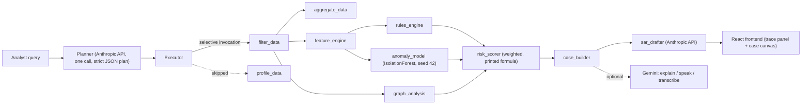

# Caseline

**Query-driven AI agent that detects money-laundering patterns in transaction
data — and shows its reasoning.**

**[Open the styled docs page](docs/index.html)** — same content as below, laid
out in Caseline's own light-theme design system rather than plain Markdown
(GitHub strips custom CSS from rendered READMEs, so this file stays plain and
the real one lives in `docs/`). Setup, GIF, and everything else that follows.

<!-- TODO: hero GIF of a query being answered with the trace streaming.
     No screen-recording capability here — record one from the running app
     (query 3, "Is customer ID 4521 suspicious?" is the best 15-second clip:
     dynamic plan -> HIGH case -> ring graph -> SAR) and drop it above this line. -->

Ask Caseline a question in plain English and it parses intent, builds a
dynamic execution plan naming which detection tools it will run and which it
is skipping and why, then returns risk-scored, explained case files with a
drafted Suspicious Activity Report. Every number on screen comes from a live
endpoint; nothing is hardcoded or invented — including in the LLM-authored
prose, which cites only evidence present in the underlying case.

```
"Is customer ID 4521 suspicious?"
  -> scoped to 4521, ran typology rules + anomaly scoring + network analysis
  -> HIGH risk, score 1.00: STRUCTURING_HIGH, RAPID_MOVEMENT, FAN_IN_RING
  -> 10-node ring, $254,317 gathered from 9 accounts, 85% moved out in 48h
  -> recommended action: report · SAR narrative drafted
```

## Run it

```bash
make setup      # python venv + npm install
make backend    # http://localhost:8000
make frontend   # http://localhost:5173
```

Copy `.env.example` to `.env` and fill in your keys. The 200k-row sample is
already committed; `make data` only rebuilds it from `data/raw` if you want to.

## What runs without each key

| | `ANTHROPIC_API_KEY` (required) | `GEMINI_API_KEY` (optional) |
|---|---|---|
| Detection (rules, anomaly, graph, scoring) | Unaffected — deterministic Python either way | Unaffected — never imported in `agent/` or any detection tool |
| The 3 canonical demo queries | Unaffected — pre-cached, replay instantly | Unaffected |
| Novel queries | Degrades to "could not be planned" instead of a fake sweep | Unaffected |
| SAR narratives | Falls back to a deterministic template from the case's own facts | Unaffected |
| "Explain simply" | Unaffected | Falls back to a real summary built from the case's evidence, no model prose |
| Read aloud | Unaffected | Falls back to the browser's built-in speech synthesis |
| Illustration / voice input | Unaffected | No fallback — simply doesn't render / doesn't appear |

## Live demo

Not yet deployed — both hosts need an interactive login from the deploying
machine. Backend: Render, from the committed `render.yaml` Blueprint (an
in-memory trace store and a model fit once at startup rule out a serverless
host). Frontend: Vercel, via `frontend/vercel.json`'s rewrite to the backend.

## Docker

```bash
docker compose up --build
```

Backend on `:8000`, frontend (nginx, proxying `/api/*`) on `:8080`. The
closest local reproduction of the hosted deploy.

## Baseline vs. Caseline

Measured by `evals/baseline.py` on a held-out test split never used to tune
any threshold. Numbers are regenerated by `make eval` and served verbatim to
the UI's Method panel from `data/method_metrics.json` — this table and the
app can never drift apart.

| System | Flags raised | Precision | Recall | False-positive rate |
|---|---|---|---|---|
| Naive threshold baseline | 32,833 | 8.4% | 49.8% | 23.97% |
| **Caseline (hybrid)** | **6,136** | **22.3%** | **24.7%** | **3.80%** |

Caseline raises **5.4x fewer flags** and cuts the false-positive rate by
**84%** relative to the naive baseline, at the cost of catching fewer of the
labeled cases (recall drops from 49.8% to 24.7%). That trade is deliberate,
not incidental — a compliance analyst reviewing every flag pays a real cost
per false positive, and the naive baseline's 23.97% FPR means roughly one in
four flags is noise. See [METHODOLOGY.md](METHODOLOGY.md) for the full
reasoning, including the honest account of what got worse and why, and the
single most important caveat: **93% of HIGH-tier accounts are corroborated
by rule+anomaly agreement rather than rule+graph**, and the anomaly model's
features overlap with what the rules already threshold on, so that
corroboration is weaker than "two independent methods agreed" implies.

Two numbers that don't fit a single table but matter more than the headline
one: **precision@50 and precision@100 are both 100%** — the top 50 and top
100 ranked accounts, by weighted score, contain zero false positives on the
held-out split. That is the number that should drive how an analyst actually
uses this tool: work the ranked list from the top, not the full flag count.
And the injected synthetic ring — the one deliberately narratable catch — is
caught: **10 of its 11 accounts flagged, aggregator identified.**

## Architecture



- **Planner and SAR drafting** are the only two places an LLM (Anthropic,
  `claude-sonnet-4-6`) touches the pipeline. Every detection number —
  rule thresholds, the anomaly score, graph structure, the weighted risk
  score — is deterministic Python. The LLM never computes a score.
- **The plan genuinely varies by query.** A count question
  ("which customers made 10+ transactions under $10,000") runs `filter_data`
  + `aggregate_data` and skips the other six tools with a stated reason each;
  an entity investigation runs all seven. See [QUERY_AUDIT.md](QUERY_AUDIT.md)
  for 20 example queries with the full plan, trace, and result captured
  verbatim.
- **Gemini is a strictly optional presentation layer** — an "Explain simply"
  panel with a matching illustration, and speech in/out — kept out of the
  diagram's critical path on purpose. It never plans a query, never drafts a
  SAR, and never sees a score it could influence. The app runs fully without
  `GEMINI_API_KEY`; every feature that uses it falls back to a deterministic
  equivalent (a plain-language summary built from the case's own figures,
  the browser's built-in speech synthesis).

## Typologies

Seven named patterns, each a deterministic rule or graph check with its own
domain rationale — see `backend/tools/rules_engine.py` and
`backend/tools/graph_analysis.py` for the implementations, or ask Caseline
itself ("What is structuring?") for the same explanations rendered live.

| Typology | Rule | Why |
|---|---|---|
| **Structuring (confirmed)** | 5+ deposits between $9,500–$10,000 into one account within 7 days, AND 60%+ moved back out within 7 days | The onward transfer separates laundering from an ordinary cash business — a shop banks its takings and leaves them; a mule gathers and forwards |
| **Structuring (indicator)** | 3+ transactions between $9,000–$10,000 within 7 days, either side of the account | A weaker signal alone — plenty of legitimate businesses look like this — so it surfaces an account for review but never escalates it by itself |
| **Velocity** | Peak transactions/hour > 4σ above the account's own baseline, with 10+ prior transactions | Compared against the account's own history, not the population; the 10-transaction minimum exists because a standard deviation from 3 transactions is noise |
| **Rapid movement** | 80%+ of inbound funds sent out within 48h, on $1,000+ gathered from 2+ distinct senders | Requiring 2+ senders is what distinguishes a funnel from ordinary two-party settlement, where fast in-and-out is normal |
| **High-risk amount** | One transaction > 4σ above the account's own history, with 10+ prior transactions | Same self-comparison reasoning as velocity |
| **Fan-in ring** | 5+ distinct senders into one account within 7 days, with 60%+ of the total moving onward | Found on the transaction graph rather than any single account's numbers — corroborates the rules rather than repeating them |
| **Round-trip cycle** | A closed loop of 3–5 hops on the transfer graph | Two-party back-and-forth is deliberately excluded — that's just two people paying each other, extremely common and not laundering |

**Scoring** (`backend/tools/risk_scorer.py`, printed in full on the Method
panel):

```
risk_score (ranking only) = 0.45 x rules_component + 0.35 x graph_component + 0.20 x anomaly_component
risk_level (tier) = HIGH if a STRONG rule fired AND corroborated by a second detection
                     method (graph or anomaly-high); MEDIUM if exactly one method fired
                     (or only a weak rule); LOW if anomaly-high alone
```

## Testing & evals

```bash
make test           # 128 unit/integration tests (offline, no server needed)
make test-live      # 29 more tests against a running backend (make backend first)
make verify          # 45 end-to-end checks through the frontend's own path (:5173)
make verify-backend  # the same 45 checks hitting :8000 directly
make eval            # the 12-query eval suite + the baseline comparison above
```

157 tests total. `make eval` regenerates `data/method_metrics.json` from
scratch on the held-out split, so the numbers in this README and the app's
Method panel are always exactly what was last measured, never hand-typed.
[TESTING.md](TESTING.md) has the full test report, including which of the
bugs found along the way were real. [QUERY_AUDIT.md](QUERY_AUDIT.md) is a
20-query manual audit with every response captured verbatim, including five
open quality findings not yet resolved (results dominated by low-confidence
anomaly hits on broad queries, ranking not surfacing the demo ring first on
a ring query, and others) — read it before assuming everything below "the
tests pass" is settled.

## Dataset & synthetic data

**IBM Transactions for Anti-Money Laundering (HI-Small)**, via Kaggle,
Community Data License Agreement — Sharing 1.0. ~200k rows sampled from
5.08M raw transactions with a fixed seed, preserving every labeled
laundering transaction and its counterparties. Full sampling methodology,
the `laundering_type` join and its known ~62% coverage gap (a property of
the upstream Kaggle files, not a join bug — see
`backend/tests/test_data_layer.py`), currency normalization, and the
customer-4521 alias are documented in [DATA.md](DATA.md).

**One synthetic ring is injected and clearly marked**
(`laundering_type = "SMURFING (synthetic)"`, transaction ids `S0000...`):
9 mule accounts each make 3 sub-threshold deposits into aggregator account
`4521` over 6 days, which then moves ~85% of the pooled funds out within
48 hours. This is the deliberately narratable catch used throughout the demo
and this README — see [DATA.md](DATA.md) for the exact injection parameters.

## Disclosure

- **AI tooling:** built with Claude Code (Anthropic).
  - **Anthropic API** (`claude-sonnet-4-6`) — query planning and SAR
    narrative drafting. Required; every other detection computation is
    deterministic Python (pandas/scikit-learn/networkx), and the LLM never
    computes, adjusts, or ranks a risk score.
  - **Google Gemini API** — presentation layer only: the "Explain simply"
    panel and its illustration (`gemini-3.1-flash-image`), speech in/out,
    and small-talk replies to non-detection messages ("hi", "thanks"). All
    optional; the app runs fully without a key, and every feature that uses
    it degrades to a deterministic fallback rather than failing. Gemini
    never plans a query, never drafts a SAR, and never sees a score it
    could influence — enforced, not just documented: nothing in
    `backend/agent/` or any detection tool imports it.
- **Synthetic data:** one injected, clearly-marked smurfing ring — see
  Dataset above and [DATA.md](DATA.md).

## Team

- **Keshav Dadhich** — architecture, the agent (planner/executor/tools),
  detection logic, frontend, deployment.
- **Khanak Shah** — QE pass that found and fixed two real bugs (`.env` was
  never loaded at runtime despite `python-dotenv` being a dependency; stale
  `"STRUCTURING"` test literals after the rules split into HIGH/MEDIUM
  tiers — see the regression tests each fix added), and built the PDF case
  export (`xhtml2pdf`).
