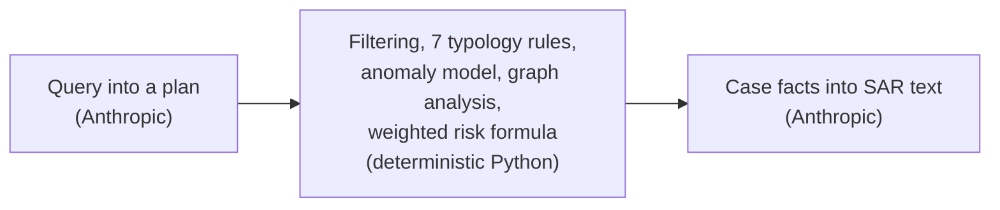
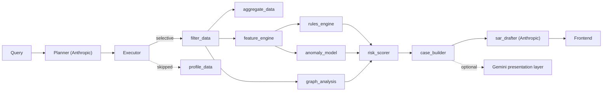

<div align="center">

# Caseline

**Query-driven AI agent for anti-money-laundering detection.**
**Deterministic scoring. Explained flags. No fabricated numbers.**

**[Live app](https://frontend-two-rho-4kpyvvuh8c.vercel.app)** &middot; **[Live API](https://caseline-backend.onrender.com/api/health)**

| 5.4x | 84% | 100% |
|:-----:|:-----:|:-----:|
| fewer false flags than a naive baseline | lower false-positive rate | precision at the top 100 ranked accounts |

</div>

<!-- TODO: hero GIF of a query being answered with the trace streaming.
     No screen-recording capability in this environment. Query 3, "Is
     customer ID 4521 suspicious?", is the best clip: dynamic plan, HIGH
     case, ring graph, SAR. Record it and drop it here. -->

<div align="center">

Ask a question in plain English. Caseline builds a plan naming which tools
it will run and which it skips, then returns risk-scored case files with a
drafted Suspicious Activity Report. Every number on screen comes from a
live endpoint.

</div>

```
> Is customer ID 4521 suspicious?

Scoped to 4521. Ran typology rules, anomaly scoring, network analysis.

HIGH risk, score 1.00
  STRUCTURING_HIGH, RAPID_MOVEMENT, FAN_IN_RING
  10-node ring, $254,317 gathered from 9 accounts
  85% moved out within 48h
  Recommended action: report
  SAR narrative drafted (239 words)
```

---

<div align="center">

## Run it locally

</div>

| Requirement | Version | Why |
|:---:|:---:|:---:|
| Python | 3.11+ | FastAPI backend, pandas, scikit-learn, networkx |
| Node.js | 22+ | Vite and React frontend build |
| `ANTHROPIC_API_KEY` | &mdash; | Required. Query planning and SAR drafting only |
| `GEMINI_API_KEY` | &mdash; | Optional. Presentation layer only, see below |

```bash
make setup      # python venv + npm install
make backend    # http://localhost:8000
make frontend   # http://localhost:5173
```

<div align="center">

Copy `.env.example` to `.env` and fill in your keys before starting the
backend. The 200k-row dataset sample is already committed.

</div>

<div align="center">

## Test everything

</div>

| Command | Runs | Needs a server |
|:---:|:---:|:---:|
| `make test` | 128 unit and integration tests | No |
| `make test-live` | 29 more tests against real endpoints | Yes, `make backend` |
| `make verify` | 45 end-to-end checks, frontend path | Yes, both |
| `make verify-backend` | Same 45 checks, direct to backend | Yes, `make backend` |
| `make eval` | 12 query evals, regenerates the baseline table | Yes, `make backend` |

<div align="center">

157 tests total. `make eval` regenerates `data/method_metrics.json` from
scratch, so this README and the app's own Method panel can never drift
apart.

</div>

<div align="center">

## What runs without each key

</div>

| | `ANTHROPIC_API_KEY` | `GEMINI_API_KEY` |
|:---:|:---:|:---:|
| Status | Required | Optional |
| Detection, rules, anomaly, graph, scoring | Unaffected | Unaffected |
| The 3 canonical demo queries | Unaffected, pre-cached | Unaffected |
| Novel queries | Degrades to "could not be planned" | Unaffected |
| SAR narrative | Falls back to a deterministic template | Unaffected |
| "Explain simply" | Unaffected | Falls back to a deterministic summary |
| Read aloud | Unaffected | Falls back to browser speech synthesis |
| Illustration, voice input | Unaffected | Not available, no fallback |

<div align="center">

Nothing silently fails. Every gap above degrades to a stated fallback.

**With no `ANTHROPIC_API_KEY` at all, most of the app still runs.** The 3
canonical demo queries, and anything already cached to `.cache/plans`,
execute in full: evidence, scores, and SAR narrative included, since none
of that touches an LLM. Only a genuinely new question that was never
cached cannot be planned, and Caseline says so plainly instead of
guessing. This is the same mechanism behind the offline demo: cached plans
and deterministic fallbacks, not a live connection, are what the app
actually depends on. Verified directly: with the key blanked, the demo
queries still returned correct results and a real 263-word SAR narrative.

</div>

---

<div align="center">

## Deployment

</div>

| Service | URL | Host |
|:---:|:---:|:---:|
| App | [frontend-two-rho-4kpyvvuh8c.vercel.app](https://frontend-two-rho-4kpyvvuh8c.vercel.app) | Vercel |
| API | [caseline-backend.onrender.com](https://caseline-backend.onrender.com) | Render |

<div align="center">

Free-tier note: the backend has no persistent disk, so a fresh instance
starts with an empty plan cache. A query it hasn't seen yet costs a live
10 to 20 second planner call instead of an instant replay. Occasional 502s
under back-to-back load have shown up in testing. Fine for browsing; the
in-person demo runs locally.

</div>

<div align="center">

## Docker

</div>

```bash
docker compose up --build
```

| Service | Port | What it is |
|:---:|:---:|:---:|
| backend | `:8000` | FastAPI, direct |
| frontend | `:8080` | nginx, serves the build and proxies `/api/*` |

<div align="center">

Closest local reproduction of the hosted deploy. Same `.env` at the repo
root.

</div>

<div align="center">

## All commands

</div>

| Command | Does |
|:---:|:---:|
| `make setup` | Python venv, npm install |
| `make data` | Rebuilds `data/sample` from `data/raw` (optional, sample is committed) |
| `make backend` | Runs the API on `:8000` |
| `make frontend` | Runs the dev server on `:5173` |
| `make test` | 128 offline tests |
| `make test-live` | 29 tests against a running backend |
| `make verify` | 45 end-to-end checks, frontend path |
| `make verify-backend` | 45 end-to-end checks, backend path |
| `make eval` | Eval suite plus baseline comparison |
| `make docker` | `docker compose up --build` |

---

<div align="center">

## Features

</div>

<div align="center">

**Agent and planning**

</div>

| Feature | Detail |
|:---:|:---:|
| Dynamic execution plan | One plan per query, not a fixed pipeline |
| Explicit skips | Every unused tool shown with a stated reason |
| Clarifying questions | Ambiguous queries get asked, not guessed |
| Disk-cached plans | Pre-warmed queries survive an offline demo |
| Conversational routing | Greetings and small talk skip the planner entirely |
| Guarded routing | Any detection-vocabulary word forces a real plan, never small talk |

<div align="center">

**Detection, all deterministic**

</div>

| Feature | Detail |
|:---:|:---:|
| 7 typologies | 2 structuring tiers, velocity, rapid movement, high-risk amount, fan-in ring, cycle |
| Anomaly scoring | IsolationForest, fixed seed, reproducible |
| Graph analysis | networkx fan-in and cycle detection |
| Weighted risk formula | Printed in full, never a black box |
| Tiered corroboration | HIGH needs 2 independent signals, not 1 |
| Plain counting tool | Factual questions get a count, not a typology guess |
| Dataset profiling tool | Overview questions get real summary stats |
| Explicit date ranges | Never silently collapsed into a relative window |

<div align="center">

**Case management**

</div>

| Feature | Detail |
|:---:|:---:|
| Full case file | Evidence table, timeline, ring subgraph |
| SAR narrative | LLM drafted, deterministic template fallback |
| PDF export | One click, real PDF, not a browser print dialog |
| Threshold spark-timeline | Deposits plotted against the reporting threshold |
| Ring focus mode | Click a node, unrelated edges fade |

<div align="center">

**Presentation layer, optional and isolated**

</div>

| Feature | Detail |
|:---:|:---:|
| Explain simply | Plain-language summary plus a matching illustration |
| Read aloud | Text to speech, browser fallback |
| Voice input | Speech to text in the query bar |
| Small talk | Greetings answered without touching detection |

<div align="center">

**Engineering**

</div>

| Feature | Detail |
|:---:|:---:|
| 157 automated tests | Unit, integration, live, end-to-end |
| Honest eval suite | 12 canonical queries plus a baseline comparison |
| Fixed seeds everywhere | Same query, same output, every machine |
| Docker and hosted deploy | Both configured, both verified live |
| Two designed themes | Light default, dark is its own palette, not an inversion |

---

<div align="center">

## Where the LLM is used

</div>



| Touchpoint | Model | Why an LLM | Without a key |
|:---:|:---:|:---:|:---:|
| Query planner | `claude-sonnet-4-6` | Parses open phrasing into a fixed tool schema | Cached plan or a plain reply |
| SAR drafter | `claude-sonnet-4-6` | Case facts read better as prose than a template | Deterministic template |
| Explain simply | Gemini text | Plain-language rewrite, presentation only | Deterministic summary |
| Illustration | Gemini image | Visual aid, presentation only | Doesn't render |
| Read aloud | Gemini TTS | Convenience, presentation only | Browser speech synthesis |
| Voice input | Gemini STT | Convenience, presentation only | Mic hidden |

<div align="center">

No LLM computes, adjusts, or ranks a risk score. Filtering, feature
engineering, all 7 rules, anomaly scoring, graph analysis, and the final
weighted score are 100% deterministic Python. Ask the same question twice,
get the same numbers back.

</div>

---

<div align="center">

## Why this is different

</div>

| | Typical hackathon AI tool | Caseline |
|:---:|:---:|:---:|
| Query handling | One fixed pipeline for every question | A plan built per query, tools skipped with a reason |
| Scoring | Black-box model output | Printed formula, every component named |
| Detection method | Usually one method | Rules, anomaly model, and graph, cross-checked |
| Numbers on screen | Often illustrative or hardcoded | Every figure from a live endpoint |
| Baseline comparison | Rarely shown | Naive baseline vs. Caseline, both measured |
| Known weaknesses | Rarely disclosed | Documented in [METHODOLOGY.md](METHODOLOGY.md) and [QUERY_AUDIT.md](QUERY_AUDIT.md) |
| Offline behaviour | Usually breaks | Degrades to a stated fallback, never fails silently |
| Test coverage | Often none | 157 tests, 45 end-to-end checks |

---

<div align="center">

## Why the architecture holds up

</div>

- The plan is decided before anything runs. No hidden branching, no
  surprise tool calls mid-query.
- Every stage is independently testable. Rules, anomaly scoring, and graph
  analysis are each verified in isolation, not only end to end.
- The scoring formula is printed, not hidden. Any reviewer can check the
  arithmetic themselves.
- Failure degrades instead of cascading. A slow model, a missing key, or
  an unplannable query each falls back to a defined, tested state.
- The two LLM calls are narrow and replaceable. Detection keeps working
  even if the planner or the SAR drafter were removed entirely.
- Presentation cannot influence detection. The optional Gemini layer has
  no path back into the scoring engine, by construction, not convention.
- Every run is reproducible. Fixed seeds mean the same query returns the
  same numbers on any machine.
- Nothing on screen is invented. Every figure traces to a live
  computation, checked against source before this document was written.

---

<div align="center">

## Architecture

</div>



| Stage | Tool | Deterministic |
|:---:|:---:|:---:|
| Plan | `planner` | No |
| Filter | `filter_data` | Yes |
| Profile | `profile_data` | Yes |
| Count | `aggregate_data` | Yes |
| Features | `feature_engine` | Yes |
| Rules | `rules_engine` | Yes |
| Anomaly | `anomaly_model` | Yes |
| Graph | `graph_analysis` | Yes |
| Score | `risk_scorer` | Yes |
| Case | `case_builder` | Yes |
| SAR | `sar_drafter` | No |

- Planner runs once per query.
- Executor only calls tools the plan names.
- Skipped tools render with a stated reason.
- Detection tools never call an LLM.
- SAR drafter reads the finished case, never raw transactions.
- Gemini sits off the critical path. It never feeds back into `risk_scorer`.

<div align="center">

**Scoring formula**, printed in full on the app's Method panel:

</div>

```
risk_score (ranking only) = 0.45 x rules_component
                           + 0.35 x graph_component
                           + 0.20 x anomaly_component

risk_level (tier):
  HIGH   a strong rule fired, corroborated by graph or anomaly-high
  MEDIUM exactly one method fired, or only a weak rule
  LOW    anomaly-high alone
```

---

<div align="center">

## Method: baseline vs. Caseline

</div>

<div align="center">

Measured by `evals/baseline.py` on a held-out test split, never used to
tune any threshold.

</div>

| System | Flags | Precision | Recall | False-positive rate |
|:---:|:---:|:---:|:---:|:---:|
| Naive threshold baseline | 32,833 | 8.4% | 49.8% | 23.97% |
| **Caseline (hybrid)** | **6,136** | **22.3%** | **24.7%** | **3.80%** |

| Metric | Value |
|:---:|:---:|
| Fewer flags than baseline | 5.4x |
| False-positive reduction | 84% |
| Precision at top-50 ranked | 100% |
| Precision at top-100 ranked | 100% |
| Injected ring caught | 10 of 11 accounts, aggregator identified |

<div align="center">

Recall drops from 49.8% to 24.7%. That trade is deliberate: the baseline's
23.97% FPR means about one in four of its flags is noise an analyst still
has to clear. Full reasoning, including what got worse, in
[METHODOLOGY.md](METHODOLOGY.md).

</div>

---

<div align="center">

## Typologies

</div>

| Typology | Rule | Why |
|:---:|:---:|:---:|
| Structuring, confirmed | 5+ deposits, $9,500 to $10,000, within 7 days, 60%+ moved out within 7 days | The onward transfer separates laundering from a normal cash business |
| Structuring, indicator | 3+ transactions, $9,000 to $10,000, within 7 days | Weaker alone, so it flags for review, never escalates by itself |
| Velocity | Peak txns per hour over 4 sigma above own baseline, 10+ prior txns | Compared to the account's own history, not the population |
| Rapid movement | 80%+ inbound out within 48h, $1,000+, 2+ senders | 2+ senders separates a funnel from ordinary settlement |
| High-risk amount | One txn over 4 sigma above own history, 10+ prior txns | Same self-comparison logic as velocity |
| Fan-in ring | 5+ senders into one account within 7 days, 60%+ moved onward | Found on the graph, not any single account's numbers |
| Round-trip cycle | Closed loop, 3 to 5 hops on the transfer graph | Two-party back-and-forth is deliberately excluded |

<div align="center">

## Dataset

</div>

| | |
|:---:|:---:|
| Source | IBM Transactions for Anti-Money Laundering, HI-Small |
| License | Community Data License Agreement, Sharing 1.0 |
| Sample size | ~200k rows from 5.08M raw transactions |
| Sampling | Fixed seed, every labeled laundering transaction preserved |
| Synthetic ring | 9 mules into account `4521`, ~85% moved out within 48h |
| Ring marker | `laundering_type = "SMURFING (synthetic)"`, ids `S0000...` |
| Full detail | [DATA.md](DATA.md) |

---

<div align="center">

## Known limitations

</div>

| Finding | Detail |
|:---:|:---:|
| Anomaly-only LOW volume | 3 broad queries return 90%+ low-confidence rows from anomaly scoring alone |
| Ring not always top-ranked | The demo ring doesn't lead a generic "find rings" query |
| Corroboration overlap | 93% of HIGH ties reach that tier via rule and anomaly agreement, and their features overlap |
| Hosted cold start | See Deployment above |

<div align="center">

Full detail in [METHODOLOGY.md](METHODOLOGY.md) and
[QUERY_AUDIT.md](QUERY_AUDIT.md), a 20-query manual audit with every
response captured verbatim.

</div>

---

<div align="center">

## Citations and disclosures

</div>

| | |
|:---:|:---:|
| Built with | Claude Code, Anthropic |
| Anthropic API | `claude-sonnet-4-6`. Query planning, SAR drafting. Required |
| Google Gemini API | Presentation layer only, entirely optional |
| Detection logic | Deterministic Python: pandas, scikit-learn, networkx |
| Synthetic data | One injected, clearly marked smurfing ring, see [DATA.md](DATA.md) |

---

<div align="center">

## Team

</div>

| | Contribution |
|:---:|:---:|
| Keshav Dadhich | Architecture, the agent, detection logic, frontend, deployment |
| Khanak Shah | QE pass, 2 real bugs found and fixed with regression tests, PDF case export |

---

<div align="center">

157 tests &middot; 12/12 evals &middot; 45/45 end-to-end &middot; IsolationForest seed 42

</div>
